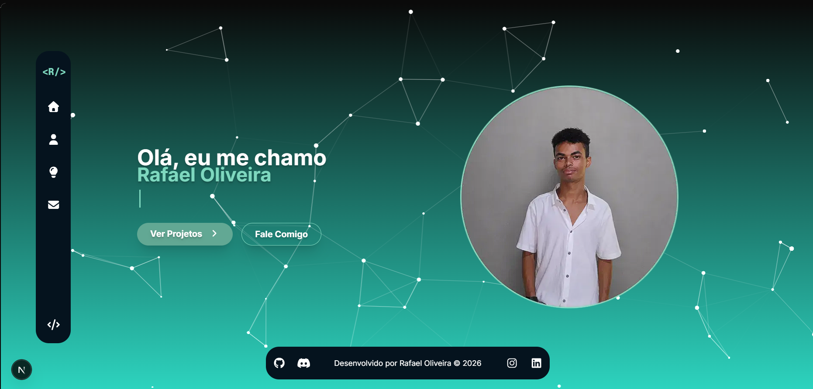

# 🚀 Rafael Oliveira | Portfólio

Portfólio pessoal desenvolvido para apresentar minha trajetória, projetos e habilidades como estudante de Ciência da Computação e futuro desenvolvedor Back-end/Full-Stack.

🌐 **Acesse ao vivo:** [portifolio-flame-chi.vercel.app](https://rafaellfcportifolio.vercel.app)


---

## 📖 Sobre

Sou estudante de Ciência da Computação (2º/8 semestres) na UNASP, técnico em TI pela mesma instituição, e estou me especializando em Java, Next.js e TypeScript com foco em desenvolvimento Back-end/Full-Stack. Este projeto reúne minha apresentação, habilidades, certificados e projetos em um único lugar.

## 🖼️ Preview



## ✨ Funcionalidades

- 🎨 Fundo animado com partículas (tsParticles)
- ⌨️ Efeito de digitação dinâmico (Typed.js) apresentando meus diferentes perfis
- 📱 Layout 100% responsivo (mobile, tablet e desktop)
- 🧭 Sidebar retrátil com animações nos ícones
- 🔍 Página de projetos com busca por nome e filtro por categoria (Front-End, Back-End, Full-Stack, Mobile)
- 📅 Calendário de contribuições do GitHub integrado
- 📄 Download de currículo em PT-BR e EN via modal
- 📬 Página de contato com links diretos para GitHub, LinkedIn, Instagram, Discord e WhatsApp

## 🛠️ Tecnologias

| Categoria | Stack |
|---|---|
| Framework | Next.js 16 (App Router) |
| Linguagem | TypeScript |
| Estilização | Tailwind CSS |
| Ícones | Font Awesome, React Icons |
| Animações | tsParticles, Typed.js |
| Extras | React GitHub Calendar |
| Deploy | Vercel |

## 🚀 Rodando localmente

```bash
# Clone o repositório
git clone https://github.com/RafaelLfckkj/Portifolio.git

# Entre na pasta
cd Portifolio

# Instale as dependências
npm install

# Rode o servidor de desenvolvimento
npm run dev
```

Abra [http://localhost:3000](http://localhost:3000) no navegador.

## 📁 Estrutura do projeto

```
src/app/
├── components/     # Componentes reutilizáveis (sidebar, cards, botões, modal)
├── contato/        # Página de contato
├── projetos/       # Página de projetos (com busca e filtro)
├── sobre/          # Página sobre mim (skills, certificados, contribuições)
└── page.tsx        # Home
```

## 🎯 Próximos passos

- [ ] Toggle de idioma completo (PT/EN) em todo o site
- [ ] Projeto Full-Stack para adicionar ao portfólio
- [ ] Otimizações de performance e SEO

## 📬 Contato

- 💼 [LinkedIn](https://www.linkedin.com/in/rafaellfckkj/)
- 🐙 [GitHub](https://github.com/RafaelLfckkj)
- 📷 [Instagram](https://www.instagram.com/rafaellfckkj/)
- 💬 [WhatsApp](https://wa.me/5511948751574)

---

⭐ Se curtiu o projeto, deixa uma estrela no repositório — ajuda muito e me motiva a continuar!
